# VertexLearn LMS-AI — Internmo 2nd

> A modular Learning Management System backend with AI-assisted learning, RAG, progress tracking, quizzes, gamification, points, rewards, notifications, and production-oriented infrastructure.

**Project:** Internmo 2nd / VertexLearn LMS-AI  
**Backend path:** `D:\Internmo 2nd\backend`  
**Repository:** `https://github.com/SnehashisKundu/VerterxLearn`  
**Backend:** Node.js + Express + TypeScript  
**AI service:** Python-based service  
**Database:** PostgreSQL + pgvector  
**Cache / queue infrastructure:** Redis + BullMQ  
**ORM:** Prisma 7.x  
**Validation:** Zod  
**Authentication:** JWT + RBAC

---

## Table of Contents

1. [Project Overview](#project-overview)
2. [Architecture Principles](#architecture-principles)
3. [Technology Stack](#technology-stack)
4. [Repository Structure](#repository-structure)
5. [System Architecture](#system-architecture)
6. [Global Request Data Flow](#global-request-data-flow)
7. [Authentication and Authorization](#authentication-and-authorization)
8. [Core LMS Data Flow](#core-lms-data-flow)
9. [Course and Content Flow](#course-and-content-flow)
10. [Enrollment and Progress Flow](#enrollment-and-progress-flow)
11. [Assignment Flow](#assignment-flow)
12. [Quiz and Assessment Flow](#quiz-and-assessment-flow)
13. [Certificate Flow](#certificate-flow)
14. [Badge and Streak Flow](#badge-and-streak-flow)
15. [Points / Gamification Flow](#points--gamification-flow)
16. [Reward Flow](#reward-flow)
17. [AI Tutor and RAG Flow](#ai-tutor-and-rag-flow)
18. [Document Chunk / Vector Flow](#document-chunk--vector-flow)
19. [Summary / Flashcard / AI Quiz Flow](#summary--flashcard--ai-quiz-flow)
20. [Study Plan and Recommendation Flow](#study-plan-and-recommendation-flow)
21. [Discussion and Announcement Flow](#discussion-and-announcement-flow)
22. [Notification Flow](#notification-flow)
23. [Media / File Flow](#media--file-flow)
24. [Redis and Background Job Flow](#redis-and-background-job-flow)
25. [Admin and Governance Flow](#admin-and-governance-flow)
26. [Data Architecture](#data-architecture)
27. [Database and Migration History](#database-and-migration-history)
28. [Document Chunk Drift Incident](#document-chunk-drift-incident)
29. [Security](#security)
30. [Roles and Permissions](#roles-and-permissions)
31. [Testing and Verification](#testing-and-verification)
32. [API Organization](#api-organization)
33. [Deployment Architecture](#deployment-architecture)
34. [Development Commands](#development-commands)
35. [Current Implementation Status](#current-implementation-status)
36. [Planned / PRD Scope](#planned--prd-scope)
37. [Engineering Rules](#engineering-rules)
38. [Final End-to-End Data Flow](#final-end-to-end-data-flow)

---

# Project Overview

VertexLearn LMS-AI is an LMS backend designed around conventional learning workflows plus an AI layer.

The platform combines:

- Authentication and authorization
- Course management
- Modules and lectures
- Enrollment
- Lecture progress
- Notes and bookmarks
- Assignments and submissions
- Quizzes and quiz attempts
- Certificates
- Badges
- Streaks
- Point rules
- Point wallets
- Reward redemption and fulfillment
- AI Tutor
- Retrieval-Augmented Generation (RAG)
- Document chunk embeddings
- Lecture summaries
- Flashcards
- AI-generated quizzes
- Study plans
- Recommendations
- Discussions
- Announcements
- Notifications
- Administrative governance
- Redis / BullMQ infrastructure
- PostgreSQL persistence

The PRD defines three primary platform roles:

```text
Student
Instructor
Admin
```

The actual backend can contain additional internal/application roles as the implementation evolves.

The PRD describes the platform as a multi-tenant-ready LMS-AI architecture with role-specific workspaces and a separated AI service. fileciteturn151file1L711-L722

---

# Architecture Principles

The backend follows a layered, module-oriented architecture:

```text
Client
  ↓
Routes
  ↓
Middleware
  ↓
Controller
  ↓
Service
  ↓
Prisma
  ↓
PostgreSQL
```

External infrastructure participates only where required:

```text
                    ┌── Redis
                    ├── BullMQ / Workers
                    ├── AI Service
                    ├── Cloudinary / Object Storage
                    ├── Email / SMS
                    └── Other external providers
```

The project separates:

### Routes

Responsible for:

- Endpoint definitions
- Middleware composition
- HTTP method mapping

### Middleware

Responsible for:

- Authentication
- Authorization
- Security
- Request processing

### Controllers

Responsible for:

- Reading HTTP input
- Calling services
- Returning HTTP responses

### Services

Responsible for:

- Business rules
- Transactions
- Workflow decisions
- Database orchestration
- External service coordination

### Prisma

Responsible for:

- Database access
- Query execution
- Persistence
- Relations

This separation keeps business logic out of route definitions and prevents controllers from becoming large workflow containers.

---

# Technology Stack

| Layer | Technology |
|---|---|
| Runtime | Node.js |
| Language | TypeScript |
| API | Express.js |
| ORM | Prisma 7.x |
| Database | PostgreSQL |
| Vector Search | PostgreSQL pgvector |
| Cache | Redis |
| Background Jobs | BullMQ |
| Authentication | JWT |
| Validation | Zod |
| Password Hashing | bcrypt |
| Security | Helmet / CORS |
| AI Service | Python |
| LLM integration | AI service / provider integration |
| Media | Cloudinary / object storage depending on workflow |
| Email | Nodemailer / notification provider |
| PDFs | PDF generation tooling |
| Containerization | Docker / Docker Compose |
| Deployment | Render configuration exists |
| API testing | Postman / similar tools |

The PRD specifies PostgreSQL as the system of record, pgvector for embeddings, and Redis for caching and queues. fileciteturn151file1L847-L855

---

# Repository Structure

Current project structure is organized approximately as:

```text
Internmo 2nd/
│
├── backend/
│   ├── prisma/
│   │   ├── schema.prisma
│   │   └── migrations/
│   │
│   ├── src/
│   │   ├── lib/
│   │   │   ├── prisma.ts
│   │   │   ├── redis.ts
│   │   │   └── jwt.ts
│   │   │
│   │   ├── middleware/
│   │   │   ├── auth.middleware.ts
│   │   │   └── role.middleware.ts
│   │   │
│   │   ├── modules/
│   │   │   ├── ai-tutor/
│   │   │   ├── auth/
│   │   │   ├── badge/
│   │   │   ├── flashcard/
│   │   │   ├── lecture-progress/
│   │   │   ├── point-rule/
│   │   │   ├── point-wallet/
│   │   │   ├── roadmap/
│   │   │   ├── reward/
│   │   │   ├── streak/
│   │   │   └── ...
│   │   │
│   │   ├── app.ts
│   │   └── server.ts
│   │
│   ├── package.json
│   └── tsconfig.json
│
├── ai-service/
│   └── ...
│
├── frontend/
│   └── ...
│
├── docs/
│   └── ...
│
└── infra/
    └── ...
```

The project README documents the modular backend layout, including auth, point rules, point wallet, rewards, streaks and supporting infrastructure. fileciteturn151file0L89-L129

---

# System Architecture

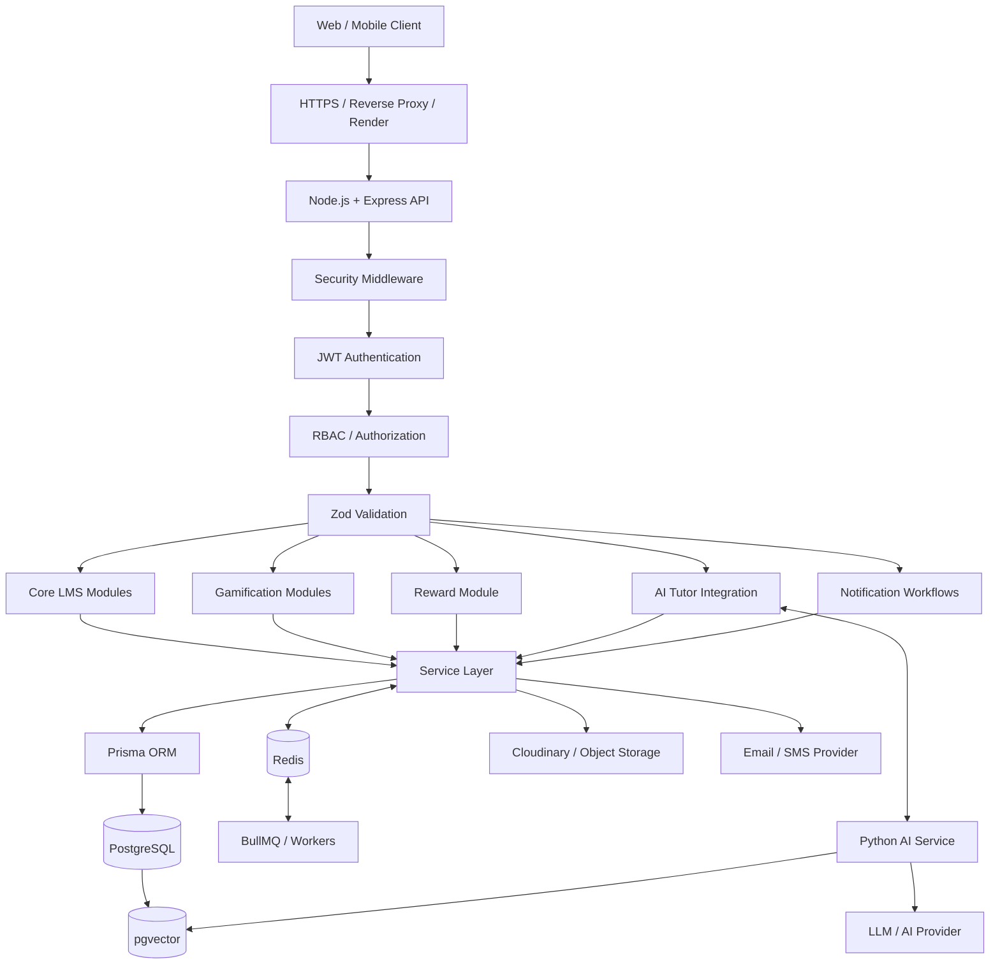

The production-oriented architecture documented for the project places the Express backend, AI service, PostgreSQL, pgvector, Redis/BullMQ and external services into separate responsibilities. fileciteturn151file1L1248-L1304

---

# Global Request Data Flow

Every protected REST request should conceptually follow:

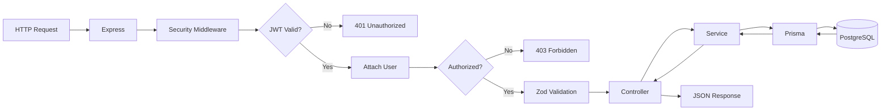

This follows the documented request lifecycle: authentication first, authorization next, validation, controller, service and persistence. fileciteturn151file0L202-L221

---

# Authentication and Authorization

## Login / Register

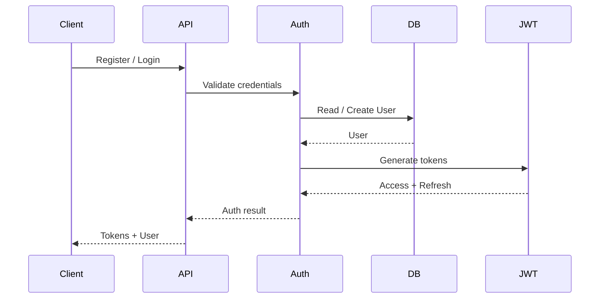

## Protected request

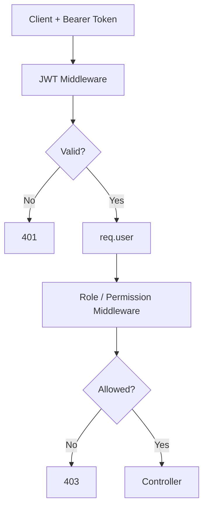

Authentication uses JWT, while authorization is handled through RBAC middleware. The PRD requires short-lived access tokens, refresh tokens, RBAC and endpoint input validation. fileciteturn151file1L832-L843

---

# Core LMS Data Flow

The central learning relationship is:

```text
User
 ↓
Enrollment
 ↓
Course
 ↓
Module
 ↓
Lecture
 ↓
Progress / Notes / Bookmarks
 ↓
Assignments / Quizzes
 ↓
Completion
 ↓
Certificate / Badge / Points / Streak
 ↓
Recommendations / AI Tutor
```

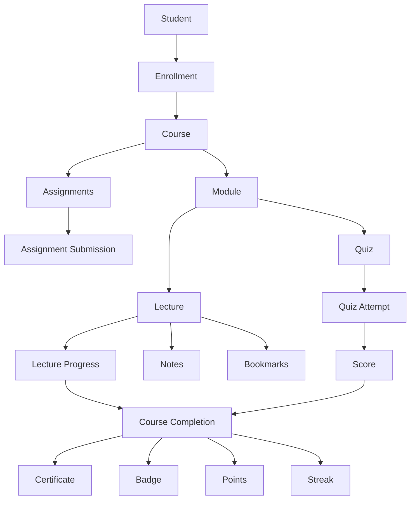

The PRD's core entities include users, courses, modules, lectures, enrollments, lecture progress, notes, bookmarks, assignments, submissions, quizzes, attempts and answers. fileciteturn151file1L847-L855

---

# Course and Content Flow

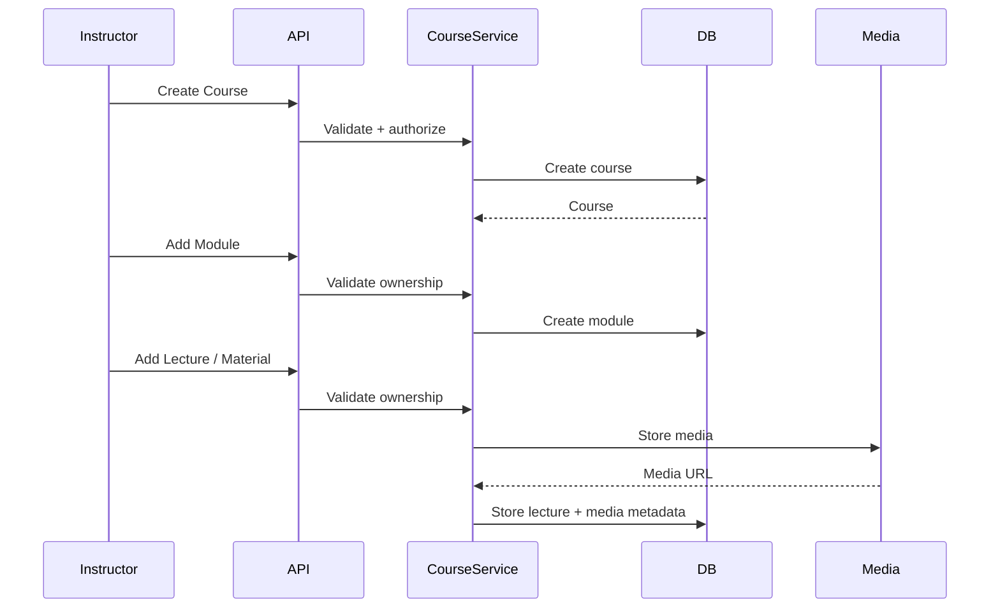

Course creation and lecture material management are instructor-controlled, while admin governance can approve or reject courses before public listing. fileciteturn151file1L812-L831

---

# Enrollment and Progress Flow

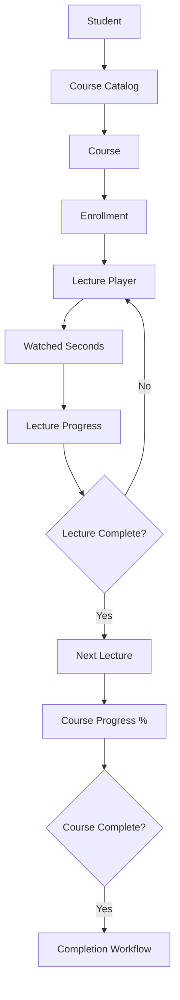

The PRD specifies enrollment, progress updates, resume-from-last-position and timestamped notes/bookmarks. fileciteturn151file1L787-L801

---

# Assignment Flow

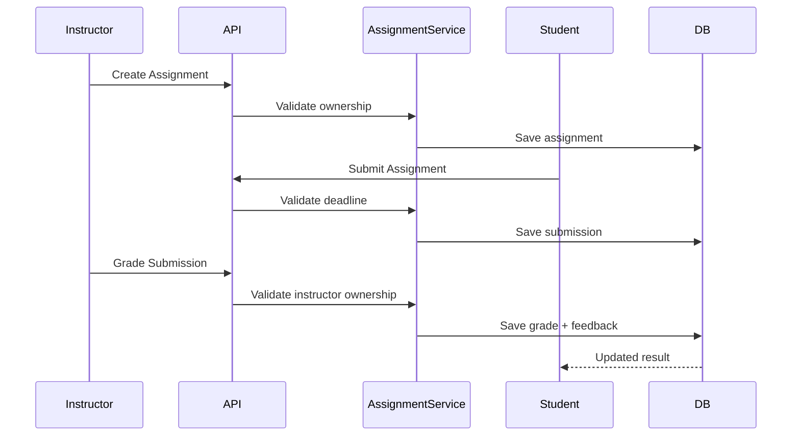

The intended assignment lifecycle includes creation, student submission before a deadline, and instructor grading. fileciteturn151file1L787-L801

---

# Quiz and Assessment Flow

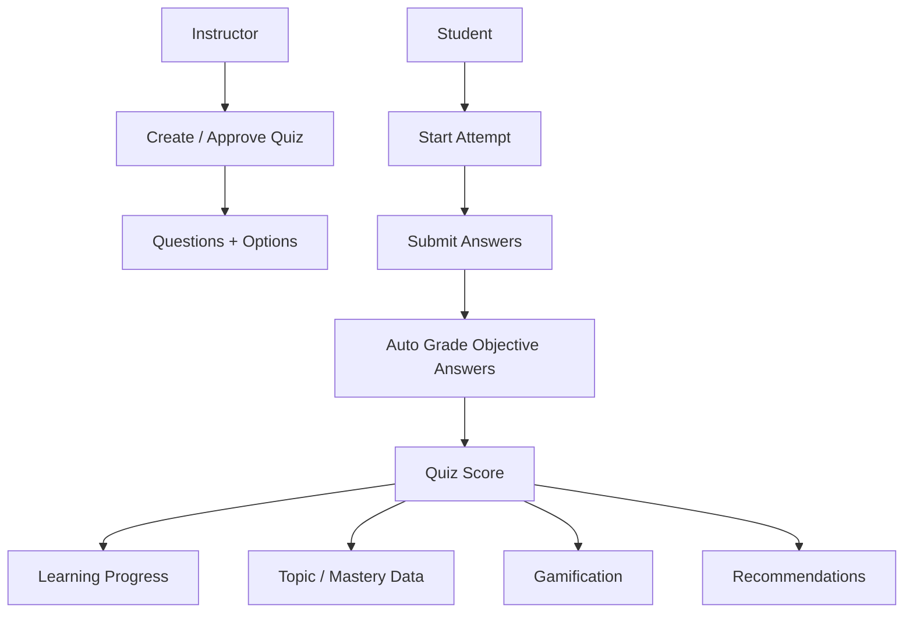

Quiz entities include:

```text
Quiz
 ├── Quiz Questions
 │    └── Quiz Options
 └── Quiz Attempts
      └── Quiz Answers
```

The PRD defines MCQ, multi-select and short-answer support, with objective-question auto-grading. fileciteturn151file1L796-L811

---

# Certificate Flow

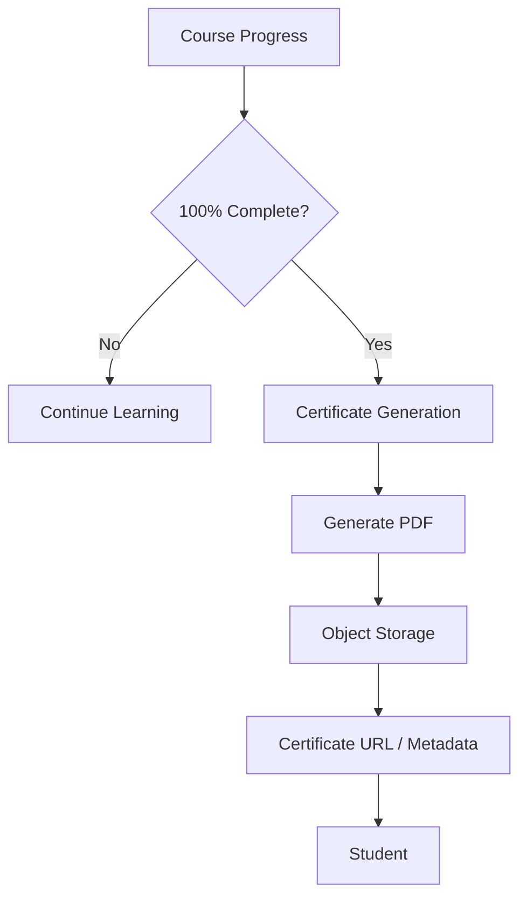

The PRD specifies automatic certificate generation after full module/course completion. fileciteturn151file1L787-L801

---

# Badge and Streak Flow

## Badge

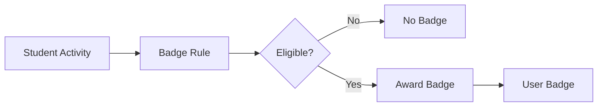

Example milestone categories defined in the PRD include:

```text
First course completed
7-day streak
Perfect quiz score
```

## Streak

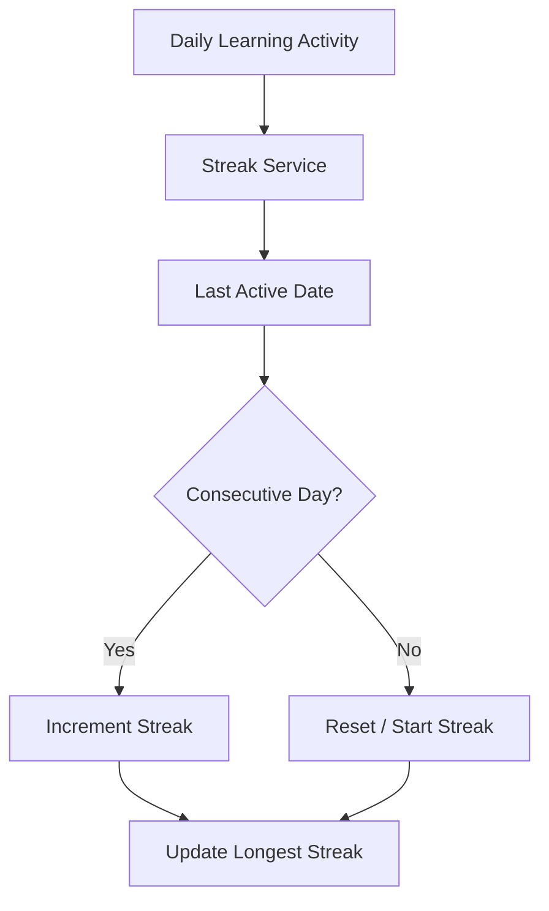

The current backend has a streak module and the project README marks it implemented. fileciteturn151file0L652-L669

---

# Points / Gamification Flow

The gamification system connects learner activity to point rules, wallets, transactions and rewards.

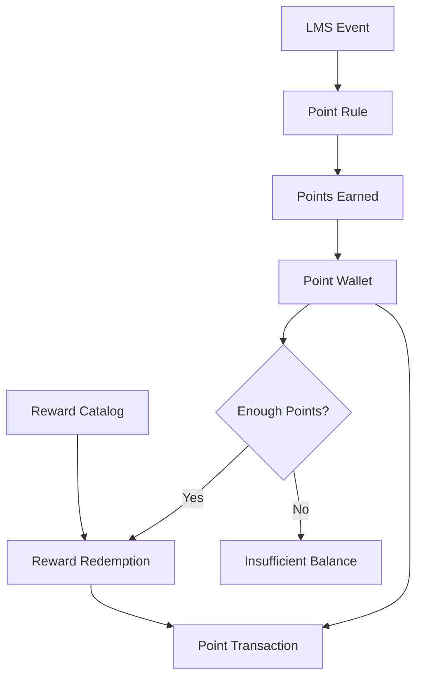

Point transaction types:

```text
EARN
REDEEM
ADJUSTMENT
```

Point wallet routes currently include:

```text
GET  /me
GET  /me/transactions
POST /earn
POST /:userId/adjust
```

These workflows have been tested with point earning, wallet balance changes and reward redemption. fileciteturn150file0L126-L169

---

# Reward Flow

## Reward data

A reward contains:

```text
id
name
description
imageUrl
type
points
isActive
createdAt
updatedAt
```

Reward types:

```text
DIGITAL
PHYSICAL
```

Examples used during testing included:

```text
Amazon Gift Card
Internmo Hoodie
```

## Redemption data

A redemption contains:

```text
id
userId
rewardId
points
status
trackingNumber
carrier
shippedAt
deliveredAt
claimedAt
fulfilledAt
createdAt
updatedAt
```

## Redemption flow

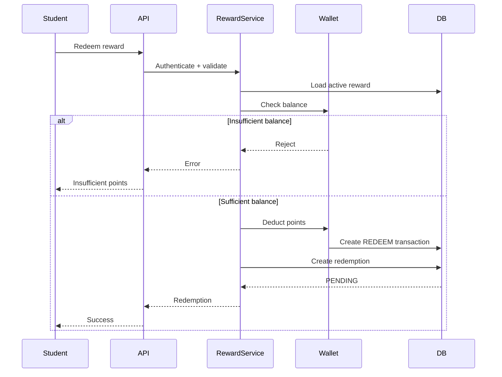

## Physical reward lifecycle

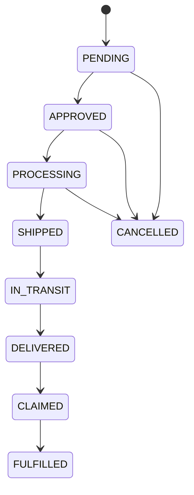

## Digital reward lifecycle

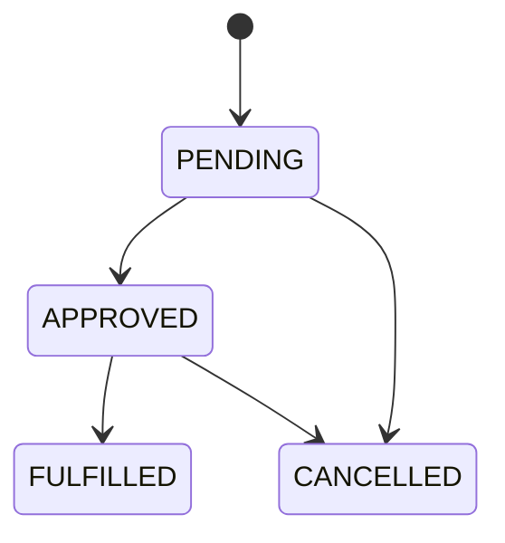

The database migration added `RewardType`, expanded redemption statuses, shipment fields and a status index. The migration is applied and the database is currently synchronized.

### Reward API areas

Student-facing:

```text
GET active rewards
GET my redemption history
POST redeem reward
```

Admin-facing:

```text
Reward management
GET all redemptions
PATCH redemption status
```

The Reward module is currently being aligned at the application-code level with the expanded database workflow.

---

# AI Tutor and RAG Flow

The AI layer is separated from the core Express application.

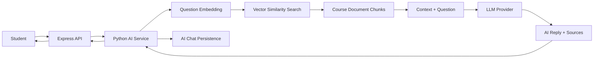

The PRD's intended RAG flow is:

1. Student sends a course-scoped question.
2. The question is embedded.
3. Similar document chunks are retrieved using `course_id`.
4. Retrieved context and the question are assembled into a prompt.
5. The LLM produces an answer.
6. Source lecture references are returned and chat data is persisted.
7. A background process can update mastery-related information. fileciteturn151file1L1284-L1304

---

# Document Chunk / Vector Flow

Current `document_chunks` contains:

```text
id
course_id
lecture_id
content
chunk_index
embedding
start_seconds
end_seconds
created_at
```

Current verified database facts:

```text
document chunks: 174
chunks with embeddings: 174
embedding dimension: 384
unique key: (lecture_id, chunk_index)
```

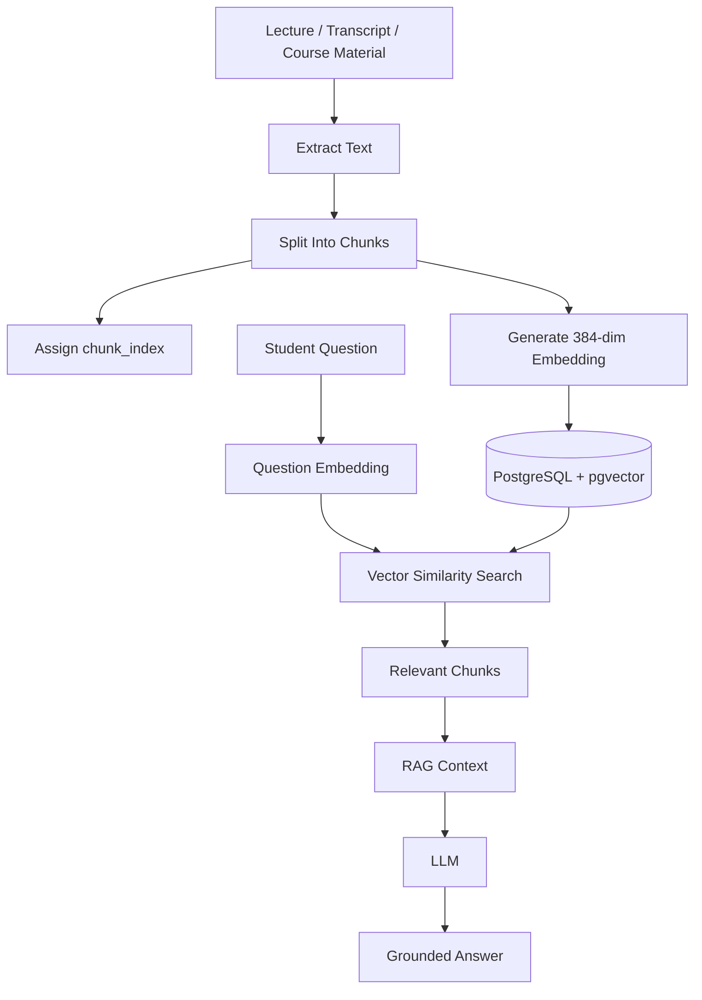

The PRD originally described a 1536-dimensional embedding schema, but the current development database and reconciled migration use **384 dimensions**. The current database state is authoritative for this implementation.

---

# Summary / Flashcard / AI Quiz Flow

## Lecture Summary

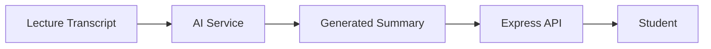

## Flashcards

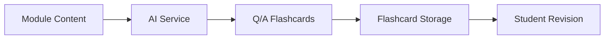

## AI-generated Quiz

```mermaid
flowchart TD
    Lecture["Lecture Transcript"] --> AI["AI Quiz Generator"]
    AI --> Draft["Quiz Draft"]
    Draft --> Instructor["Instructor Review"]
    Instructor --> Approve{"Approved?"}
    Approve -- "No" --> Edit["Edit / Reject"]
    Approve -- "Yes" --> Quiz["Published Quiz"]
    Quiz --> Student["Student Attempt"]
```

The PRD includes lecture summarization, AI quiz generation and flashcard generation as AI workflows. fileciteturn151file1L802-L811

---

# Study Plan and Recommendation Flow

## Study Plan

```mermaid
flowchart TD
    History["Quiz Score History"]
    Progress["Learning Progress"]
    Mastery["Topic Mastery"]

    History --> AI["Study Plan Generator"]
    Progress --> AI
    Mastery --> AI

    AI --> Plan["Personalized Study Plan"]
    Plan --> DB["Study Plan"]
    DB --> Student["Student"]
```

## Recommendations

```mermaid
flowchart LR
    StudentData["Student Activity"]
    Scores["Quiz Performance"]
    Progress["Course Progress"]
    Similarity["Content / Embedding Similarity"]

    StudentData --> Engine["Recommendation Engine"]
    Scores --> Engine
    Progress --> Engine
    Similarity --> Engine

    Engine --> Recommendations["Recommended Course / Topic"]
```

The PRD describes recommendation logic using learner performance and embedding similarity. fileciteturn151file1L802-L811

---

# Discussion and Announcement Flow

## Discussion

```mermaid
flowchart TD
    Student["Student"] --> Thread["Discussion Thread"]
    Thread --> Post["Discussion Post"]
    Post --> Reply["Replies / Threaded Discussion"]

    Post --> Report["Flag / Report"]
    Report --> Moderation["Admin / Instructor Moderation"]
```

## Announcement

```mermaid
flowchart LR
    Instructor["Instructor"] --> Announcement["Course Announcement"]
    Announcement --> DB["PostgreSQL"]
    DB --> Notification["Notification Workflow"]
    Notification --> Students["Enrolled Students"]
```

The PRD includes per-course threaded discussions, announcements and moderation workflows. fileciteturn151file1L748-L764

---

# Notification Flow

```mermaid
flowchart TD
    Event["System Event"]
    Event --> NotificationService["Notification Service"]

    NotificationService --> DB["Notification Record"]
    NotificationService --> Redis["Redis / Queue"]

    Redis --> Worker["Background Worker"]

    Worker --> InApp["In-App Notification"]
    Worker --> Email["Email"]
    Worker --> SMS["SMS / External Provider"]
```

Possible events include:

```text
Course updates
Assignment events
Quiz results
Reward status updates
Course completion
Certificate generation
Streak-related events
Administrative actions
```

The PRD specifies in-app and email notifications, while the backend architecture also supports asynchronous notification processing. fileciteturn151file1L748-L764

---

# Media / File Flow

```mermaid
flowchart LR
    Client["Client"] --> API["Express API"]
    API --> Validate["Validation"]
    Validate --> Storage["Cloudinary / Object Storage"]
    Storage --> URL["Asset URL"]
    URL --> DB["PostgreSQL Metadata"]
    DB --> API
    API --> Client
```

The general rule is:

```text
Binary asset → external storage
Metadata / URL → PostgreSQL
```

This prevents the relational database from becoming the primary binary-media store.

---

# Redis and Background Job Flow

Redis is used for temporary/stateful operations and queue infrastructure.

BullMQ can move expensive or asynchronous work out of the HTTP request lifecycle.

```mermaid
flowchart LR
    Request["API Request"] --> Service["Service"]
    Service --> Job["Create Job"]
    Job --> Redis[("Redis")]
    Redis --> BullMQ["BullMQ"]
    BullMQ --> Worker["Worker"]
    Worker --> Task["Background Task"]

    Task --> Email["Email"]
    Task --> AI["AI Processing"]
    Task --> PDF["PDF Generation"]
    Task --> Notify["Notifications"]
```

The PRD identifies background jobs for:

```text
Video transcription
Document chunking
Embedding generation
Recommendation recalculation
Streak evaluation
Certificate generation
Email / notification dispatch
```

fileciteturn151file1L1291-L1304

---

# Admin and Governance Flow

```mermaid
flowchart TD
    Admin["Admin"] --> API["Admin API"]
    API --> RBAC["Admin Authorization"]
    RBAC --> UserMgmt["User Management"]
    RBAC --> CourseApproval["Course Approval"]
    RBAC --> Analytics["Platform Analytics"]
    RBAC --> Moderation["Content Moderation"]
    RBAC --> Roles["Role Management"]

    CourseApproval --> Course["Course Status"]
    UserMgmt --> Users["User State"]
    Roles --> UserRoles["User Roles"]
    Moderation --> Posts["Forum Content"]
```

The PRD defines admin capabilities for user management, role assignment, account suspension, course approval, analytics and moderation. fileciteturn151file1L823-L831

---

# Data Architecture

```mermaid
flowchart TB
    API["Express API"]

    API --> AUTH["Auth"]
    API --> USERS["Users / Roles"]
    API --> LMS["Core LMS"]
    API --> AI["AI Tutor"]
    API --> GAME["Gamification"]
    API --> REWARD["Rewards"]
    API --> NOTIFY["Notifications"]
    API --> ADMIN["Admin"]

    AUTH --> DB[("PostgreSQL")]
    USERS --> DB
    LMS --> DB
    AI --> DB
    GAME --> DB
    REWARD --> DB
    NOTIFY --> DB
    ADMIN --> DB

    DB --> VECTOR[("pgvector")]

    GAME <--> REDIS[("Redis")]
    REWARD <--> REDIS
    NOTIFY <--> REDIS
    AI <--> REDIS

    REDIS --> QUEUE["BullMQ"]
    QUEUE --> WORKER["Worker"]
```

PostgreSQL is the persistent source of truth. Redis is an infrastructure component rather than the system of record. fileciteturn151file1L847-L855

---

# Database and Migration History

Current migrations:

```text
20260901170116_initial_schema
20260903180854_add_quiz_question_difficulty
20260905130349_add_student_id_card_attendance
20260906171130_add_certificate_templates
20260906192819_add_password_reset_tokens
20260909154955_add_document_chunk_embeddings
20260909160117_document_chunk
20260909161048_restore_document_chunk_embedding
20260916040000_add_points_rewards
20260917223000_add_reward_fulfillment_workflow
20260918050000_reconcile_document_chunks
```

Current database verification:

```text
npx prisma migrate status
→ Database schema is up to date!

npx prisma validate
→ The schema at prisma\schema.prisma is valid

npx tsc --noEmit
→ clean
```

---

# Document Chunk Drift Incident

A schema drift issue was found around:

```text
document_chunks.embedding
document_chunks (lecture_id, chunk_index)
```

Before reconciliation, a database backup was created:

```text
vertexlms_ai_backup.dump
```

The database contained:

```text
174 document chunks
174 chunks with embeddings
```

The actual vector dimension was verified:

```text
384
```

The reconciliation migration:

```text
20260918050000_reconcile_document_chunks
```

contains:

```sql
ALTER TABLE "document_chunks"
ALTER COLUMN "embedding" SET DATA TYPE vector(384);

CREATE UNIQUE INDEX "document_chunks_lecture_chunk_unique"
ON "document_chunks"("lecture_id", "chunk_index");
```

The drift was reconciled without resetting the development database.

The verified migration/database state is documented in the current project checkpoint. fileciteturn150file0L85-L124

### Important

Do **not** use:

```powershell
npx prisma migrate reset
```

against the current development database unless the database is intentionally disposable and a reset has explicitly been approved.

The current database contains development/test data, including document chunks and embeddings.

---

# Security

Security layers include:

```text
JWT authentication
RBAC authorization
Zod validation
Password hashing
Helmet
CORS
Protected admin routes
Environment-based secrets
Database constraints
Ownership checks in services
```

Authorization should be enforced in two levels:

```text
Role / permission check
        ↓
Resource ownership / business-rule check
```

Example:

```text
Instructor requests course mutation
        ↓
RBAC confirms instructor role
        ↓
Service confirms instructor owns course
        ↓
Mutation allowed
```

The PRD explicitly separates API role checks from service-level ownership checks. fileciteturn151file1L1405-L1427

---

# Roles and Permissions

The product-level roles defined by the PRD are:

| Capability | Student | Instructor | Admin |
|---|---:|---:|---:|
| Register / Login | Yes | Yes | Yes |
| Browse courses | Yes | Yes | Yes |
| Enroll | Yes | No | No |
| Watch lectures | Yes | No | No |
| Track progress | Yes | No | No |
| Notes / bookmarks | Yes | No | No |
| Submit assignments | Yes | No | No |
| Attempt quizzes | Yes | No | No |
| AI Tutor | Yes | Reviewer use | No |
| Create own course | No | Yes | Yes |
| Upload course material | No | Own course | Yes |
| Create / approve AI quizzes | No | Own course | Yes |
| Grade assignments | No | Own course | Yes |
| Own-course analytics | No | Yes | Yes |
| Platform analytics | No | No | Yes |
| Course approval | No | No | Yes |
| Role management | No | No | Yes |
| Account suspension | No | No | Yes |
| Forum moderation | Limited | Own course | Platform-wide |

The PRD documents this role matrix and specifies API-level role enforcement plus service-level ownership checks. fileciteturn151file1L1405-L1427

---

# Testing and Verification

## Prisma

```powershell
npx prisma validate
```

Expected:

```text
The schema at prisma\schema.prisma is valid
```

## Migration status

```powershell
npx prisma migrate status
```

Expected:

```text
Database schema is up to date!
```

## TypeScript

```powershell
npx tsc --noEmit
```

Expected:

```text
No TypeScript errors
```

## Prisma Client

```powershell
npx prisma generate
```

## Database inspection

```powershell
docker exec lms-ai-postgres psql -U verttexlms_sk -d vertexlms_ai
```

## Current vector verification

```sql
SELECT COUNT(*) AS total,
       COUNT(embedding) AS with_embedding
FROM document_chunks;
```

Expected current development data:

```text
total = 174
with_embedding = 174
```

---

# API Organization

The project uses module-based APIs.

Typical module structure:

```text
src/modules/<module>/

    <short>.routes.ts
    <short>.controller.ts
    <short>.service.ts
    <short>.validation.ts
```

Example:

```text
src/modules/reward/

    rw.routes.ts
    rw.controller.ts
    rw.service.ts
    rw.validation.ts
```

Flow:

```text
Route
 ↓
Middleware
 ↓
Validation
 ↓
Controller
 ↓
Service
 ↓
Prisma
 ↓
PostgreSQL
```

---

# Deployment Architecture

The project README documents a Render deployment configuration and production health endpoint.

```text
Production API:
https://verterxlearn.onrender.com
```

Health endpoint:

```text
GET /health
```

Expected response:

```json
{
  "success": true,
  "message": "LMS-AI API is healthy"
}
```

The deployment configuration uses:

```text
Node runtime
rootDir = backend
build = npm ci && npm run build
start = npm start
health = /health
```

The current README documents the production deployment and health-check configuration. fileciteturn151file0L464-L512

---

# Development Commands

From:

```powershell
D:\Internmo 2nd\backend
```

Install dependencies:

```powershell
npm ci
```

Generate Prisma Client:

```powershell
npx prisma generate
```

Validate schema:

```powershell
npx prisma validate
```

Check migrations:

```powershell
npx prisma migrate status
```

Type-check:

```powershell
npx tsc --noEmit
```

Development server:

```powershell
npm run dev
```

Production build:

```powershell
npm run build
```

Production start:

```powershell
npm start
```

---

# Current Implementation Status

This section deliberately distinguishes **implemented/verified**, **database-supported**, and **planned/PRD-defined** functionality. A PRD requirement is not automatically treated as an implemented backend feature.

## Verified / Implemented in the current backend checkpoint

```text
TypeScript backend                 ✅
Express API                        ✅
PostgreSQL                         ✅
Prisma                             ✅
Redis integration                  ✅
JWT authentication                 ✅
RBAC middleware                    ✅
AI Tutor module                    ✅
Point Rule module                  ✅
Point Wallet module                ✅
Streak module                      ✅
Reward base module                 ✅
Reward database workflow           ✅
Flashcard module                   ✅
Badge module                       ✅
Lecture Progress module            ✅
Roadmap module                     ✅
pgvector document embeddings       ✅
Document chunk reconciliation      ✅
Prisma schema validation            ✅
TypeScript compilation              ✅
Migration status                    ✅
```

The project README also records TypeScript, Express, PostgreSQL, Prisma, Redis, JWT, RBAC, Point Rule, Point Wallet, Streak, Reward and Render deployment as current components/status items. fileciteturn151file0L652-L669

## Database-supported Reward workflow

```text
RewardType
    DIGITAL
    PHYSICAL

RewardRedemptionStatus
    PENDING
    APPROVED
    PROCESSING
    SHIPPED
    IN_TRANSIT
    DELIVERED
    CLAIMED
    FULFILLED
    CANCELLED
```

Physical fulfillment fields:

```text
tracking_number
carrier
shipped_at
delivered_at
claimed_at
fulfilled_at
```

## Reward application-code synchronization

The database workflow is present, while application-level handling must remain synchronized across:

```text
rw.validation.ts
rw.routes.ts
rw.controller.ts
rw.service.ts
Prisma schema
```

The important application-level responsibilities are:

```text
Reward type validation
Status validation
Valid status transitions
Digital vs physical behavior
Tracking data
Shipment timestamps
Delivery timestamp
Claim timestamp
Fulfillment timestamp
Student/admin consistency
```

---

# Planned / PRD Scope

The PRD contains a larger product scope than the currently verified backend checkpoint.

These should be treated as **planned / target functionality unless verified in code**:

```text
Advanced instructor analytics
Full discussion forum workflow
Full announcement workflow
Full admin analytics
Complete course approval workflow
Payment/subscription gateway
Advanced adaptive learning
Full multilingual UI
Native mobile applications
Live video conferencing
Collaborative whiteboard
Peer-to-peer study rooms
AI plagiarism detection
Offline-first synchronization
Voice AI Tutor
SSO / SAML
Advanced cohort analytics
Marketplace payout workflows
```

The PRD explicitly lists several of these as future enhancements or outside the initial four-week scope. fileciteturn151file1L765-L775 fileciteturn151file1L1544-L1560

---

# Engineering Rules

## 1. Never mix business logic into routes

Bad:

```text
Route → huge business logic → DB
```

Correct:

```text
Route
 ↓
Controller
 ↓
Service
 ↓
Prisma
```

## 2. Authentication is not authorization

```text
Authentication
= Who are you?

Authorization
= Are you allowed to perform this action?
```

## 3. Role checks are not ownership checks

Example:

```text
Instructor role
+
Course belongs to instructor
=
mutation allowed
```

## 4. Validate external input

Use Zod before business logic.

## 5. Keep PostgreSQL as the source of truth

Redis should not become the authoritative database for persistent LMS entities.

## 6. Do not reset databases casually

Never use:

```powershell
npx prisma migrate reset
```

just to bypass drift.

First:

```text
inspect
→ backup
→ identify difference
→ create reconciliation migration
→ verify
```

## 7. Keep AI isolated

A slow LLM request should not unnecessarily block ordinary LMS CRUD operations.

The PRD explicitly recommends separating the AI service from the core LMS service. fileciteturn151file1L1525-L1540

---

# Final End-to-End Data Flow

The complete conceptual platform flow is:

```mermaid
flowchart TB

    USER["Student / Instructor / Admin"]

    CLIENT["Web / Mobile Client"]
    API["Express REST API"]

    SECURITY["Helmet / CORS / Security"]
    JWT["JWT Authentication"]
    RBAC["RBAC Authorization"]
    VALIDATE["Zod Validation"]

    AUTH["Auth"]
    COURSE["Courses"]
    CONTENT["Modules + Lectures"]
    ENROLL["Enrollment"]
    PROGRESS["Lecture Progress"]
    ASSIGN["Assignments"]
    QUIZ["Quizzes"]
    CERT["Certificates"]
    BADGE["Badges"]
    STREAK["Streak"]
    POINT_RULE["Point Rules"]
    WALLET["Point Wallet"]
    REWARD["Rewards"]
    AI_TUTOR["AI Tutor"]
    FLASH["Flashcards"]
    ROADMAP["Roadmap / Study Planning"]
    RECOMMEND["Recommendations"]
    DISCUSS["Discussions"]
    NOTIFY["Notifications"]
    ADMIN["Admin / Governance"]

    SERVICE["Service Layer"]
    PRISMA["Prisma"]

    DB[("PostgreSQL")]
    VECTOR[("pgvector")]
    REDIS[("Redis")]
    QUEUE["BullMQ Workers"]

    AISVC["Python AI Service"]
    LLM["LLM Provider"]
    MEDIA["Object / Media Storage"]
    EMAIL["Email / SMS"]

    USER --> CLIENT
    CLIENT --> API

    API --> SECURITY
    SECURITY --> JWT
    JWT --> RBAC
    RBAC --> VALIDATE

    VALIDATE --> AUTH
    VALIDATE --> COURSE
    VALIDATE --> CONTENT
    VALIDATE --> ENROLL
    VALIDATE --> PROGRESS
    VALIDATE --> ASSIGN
    VALIDATE --> QUIZ
    VALIDATE --> CERT
    VALIDATE --> BADGE
    VALIDATE --> STREAK
    VALIDATE --> POINT_RULE
    VALIDATE --> WALLET
    VALIDATE --> REWARD
    VALIDATE --> AI_TUTOR
    VALIDATE --> FLASH
    VALIDATE --> ROADMAP
    VALIDATE --> RECOMMEND
    VALIDATE --> DISCUSS
    VALIDATE --> NOTIFY
    VALIDATE --> ADMIN

    AUTH --> SERVICE
    COURSE --> SERVICE
    CONTENT --> SERVICE
    ENROLL --> SERVICE
    PROGRESS --> SERVICE
    ASSIGN --> SERVICE
    QUIZ --> SERVICE
    CERT --> SERVICE
    BADGE --> SERVICE
    STREAK --> SERVICE
    POINT_RULE --> SERVICE
    WALLET --> SERVICE
    REWARD --> SERVICE
    AI_TUTOR --> SERVICE
    FLASH --> SERVICE
    ROADMAP --> SERVICE
    RECOMMEND --> SERVICE
    DISCUSS --> SERVICE
    NOTIFY --> SERVICE
    ADMIN --> SERVICE

    SERVICE --> PRISMA
    PRISMA --> DB

    DB --> VECTOR

    SERVICE <--> REDIS
    REDIS --> QUEUE

    AI_TUTOR <--> AISVC
    AISVC <--> VECTOR
    AISVC --> LLM

    SERVICE --> MEDIA
    SERVICE --> EMAIL

    PROGRESS --> BADGE
    PROGRESS --> STREAK
    PROGRESS --> POINT_RULE

    QUIZ --> POINT_RULE
    QUIZ --> RECOMMEND
    QUIZ --> ROADMAP

    WALLET --> REWARD
    REWARD --> NOTIFY

    CONTENT --> AI_TUTOR
    CONTENT --> FLASH
    CONTENT --> QUIZ

    COURSE --> ENROLL
    ENROLL --> PROGRESS
    PROGRESS --> CERT
```

---

# Complete Learning Lifecycle

A student can conceptually move through the platform as:

```text
REGISTER / LOGIN
      ↓
AUTHENTICATED USER
      ↓
BROWSE COURSE CATALOG
      ↓
ENROLL
      ↓
WATCH LECTURES
      ↓
TRACK PROGRESS
      ↓
CREATE NOTES / BOOKMARKS
      ↓
ASK AI TUTOR
      ↓
READ SUMMARY
      ↓
REVIEW FLASHCARDS
      ↓
SUBMIT ASSIGNMENTS
      ↓
ATTEMPT QUIZZES
      ↓
SCORE / MASTERY
      ↓
RECOMMENDATIONS / STUDY PLAN
      ↓
POINTS / STREAKS / BADGES
      ↓
COURSE COMPLETION
      ↓
CERTIFICATE
      ↓
REDEEM REWARD
      ↓
DIGITAL OR PHYSICAL FULFILLMENT
```

The PRD's intended end-to-end learning loop covers watching, notes, assignments, quizzes and certification, followed by AI, recommendations and gamification capabilities. fileciteturn151file1L1431-L1462

---

# AI Learning Lifecycle

```text
LECTURE / COURSE MATERIAL
        ↓
TEXT EXTRACTION
        ↓
CHUNKING
        ↓
EMBEDDING
        ↓
PGVECTOR
        ↓
STUDENT QUESTION
        ↓
QUESTION EMBEDDING
        ↓
SIMILARITY SEARCH
        ↓
TOP-K COURSE CHUNKS
        ↓
RAG PROMPT
        ↓
LLM
        ↓
GROUNDED ANSWER
        ↓
SOURCE REFERENCES
        ↓
CHAT HISTORY
        ↓
MASTERY / RECOMMENDATION SIGNALS
```

---

# Gamification Lifecycle

```text
STUDENT ACTIVITY
      ↓
POINT RULE
      ↓
POINT EARN
      ↓
POINT WALLET
      ↓
POINT TRANSACTION
      ↓
REWARD CATALOG
      ↓
REDEMPTION
      ↓
ADMIN FULFILLMENT
      ↓
DIGITAL / PHYSICAL DELIVERY
```

Parallel learning signals:

```text
Student Activity
      ├── Streak
      ├── Badge
      ├── Progress
      ├── Quiz Score
      ├── Mastery
      └── Recommendation
```

---

# Operational Safety Checklist

Before changing the database:

```text
[ ] Check git status
[ ] Check Prisma migration status
[ ] Inspect actual PostgreSQL schema
[ ] Backup important development data
[ ] Identify exact schema difference
[ ] Create explicit migration
[ ] Apply migration
[ ] Run prisma validate
[ ] Run prisma migrate status
[ ] Run TypeScript check
[ ] Test affected API workflow
```

For schema drift:

```text
DO NOT immediately reset.

First:
    inspect
    backup
    compare
    reconcile
    verify
```

---

# Project Checkpoint

At the current checkpoint:

```text
Database:
    PostgreSQL                         ✅
    pgvector                           ✅
    Reward workflow schema              ✅
    Document embeddings                 ✅
    Migration history                   ✅

Backend:
    Express                             ✅
    TypeScript                          ✅
    Prisma                              ✅
    JWT                                 ✅
    RBAC                                ✅
    Zod                                 ✅

AI:
    AI Tutor                            ✅
    Document chunks                     ✅
    Embeddings                          ✅
    RAG infrastructure                  ✅

Gamification:
    Point Rule                          ✅
    Point Wallet                        ✅
    Streak                              ✅
    Badge                               ✅
    Reward base                         ✅

Reward:
    Digital / Physical types            ✅ DB
    Fulfillment statuses                ✅ DB
    Tracking fields                     ✅ DB
    Status index                        ✅ DB
    Application workflow synchronization 🔄
```

---

# Source of Truth Rules

This README combines three kinds of information:

### 1. Current implementation evidence

Derived from the current backend checkpoint, migration state, schema checks and tested workflows.

### 2. Product requirements

The PRD defines the intended LMS-AI product scope and architecture. Requirements marked as PRD/planned should not be interpreted as proof that the corresponding production implementation already exists.

### 3. Architecture guidance

Some infrastructure such as BullMQ, object storage, notification providers and production scaling is documented as supported or planned architecture. A component being present in the architecture does not mean every workflow using it is currently active.

This distinction is intentional so the README does not overstate implementation status.

---

# Project Identity

## VertexLearn — LMS-AI

Backend architecture:

```text
Node.js
+
Express
+
TypeScript
+
Prisma
+
PostgreSQL
+
pgvector
+
Redis
+
BullMQ
+
JWT/RBAC
+
Python AI Service
```

Repository:

```text
https://github.com/SnehashisKundu/VerterxLearn
```

Backend:

```text
D:\Internmo 2nd\backend
```

---

## Final Architecture Summary

```text
                    VERTEXLEARN LMS-AI
                           │
                           ▼
                 ┌───────────────────┐
                 │   Client Apps     │
                 └─────────┬─────────┘
                           │ HTTPS
                           ▼
                 ┌───────────────────┐
                 │  Express API      │
                 └─────────┬─────────┘
                           │
          ┌────────────────┼────────────────┐
          ▼                ▼                ▼
       JWT/RBAC         Validation       Middleware
          │                │                │
          └────────────────┼────────────────┘
                           ▼
                  ┌─────────────────┐
                  │ Module Layer    │
                  ├─────────────────┤
                  │ Auth            │
                  │ Courses         │
                  │ Progress        │
                  │ Quizzes         │
                  │ AI Tutor        │
                  │ Flashcards      │
                  │ Roadmap         │
                  │ Points          │
                  │ Streak          │
                  │ Badges          │
                  │ Rewards         │
                  │ Notifications   │
                  │ Admin           │
                  └────────┬────────┘
                           ▼
                  ┌─────────────────┐
                  │ Service Layer   │
                  └────────┬────────┘
                           ▼
                  ┌─────────────────┐
                  │ Prisma ORM      │
                  └────────┬────────┘
                           ▼
              ┌─────────────────────────┐
              │      PostgreSQL         │
              │                         │
              │ LMS + Users + Progress  │
              │ Quizzes + Gamification  │
              │ Rewards + Notifications │
              └───────────┬─────────────┘
                          │
                       pgvector
                          │
                          ▼
                 ┌─────────────────┐
                 │   AI / RAG      │
                 │ Python Service  │
                 └────────┬────────┘
                          ▼
                     LLM Provider

        Redis ──► BullMQ ──► Background Workers
          │
          ├── Notifications
          ├── Embeddings
          ├── Certificates
          ├── Recommendations
          └── Other async jobs
```

**VertexLearn LMS-AI is therefore organized as a modular transactional LMS core, a separate AI/RAG layer, and supporting cache/queue infrastructure, with PostgreSQL remaining the persistent system of record.**
